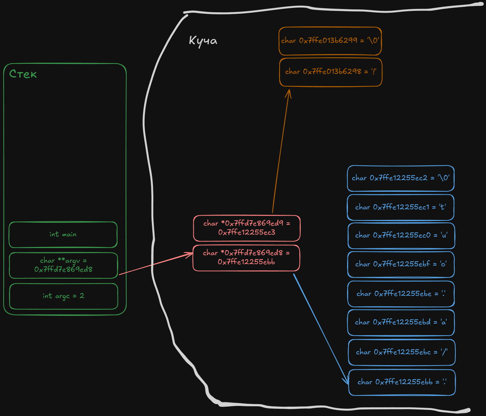

## user@machine:~$ ls

notes:
Real programs always take some input. Even a simple command that seimingly takes no input from the user, like `ls`, needs to know where it was launched.

---

```c
int main(int argc, char **argv) {
	return 0;
}
```

notes:
[Last time](c-the-language.md), I mentioned that the main function can take either two arguments or no arguments. Here are the two arguments I was talking about. The first one is obvious, it is the `arg`ument `count`. But what is the second one?

---

## Pointers
notes:
To understand that, we first need to learn about pointers.
Aside from the types I've mentioned earlier, there are pointer types. A pointer is *a variable that stores the memory address of another variable.* Here's a diagram:

---



When you ask the shell to start an app, it allocates a continuous chunk of memory called the stack. All the variables and functions you create go here. The stack is very fast, but also limited in size, just 8192KB on my system (according to `ulimit -s`).

If you need more, you ask the system. It allocates another continuous block on the heap and gives you the address of its first byte. The block is like a variable, but instead of the name it has a raw address, its index inside the memory. Every time you run the program, the address will be different, so storing it in the code is impossible.

That's why there's a special type of variables, called pointers, that point to other memory. To get the next byte, you add 1 to the address.

Syntactically, a pointer has the same type as the data it points to, plus an asterisk before the name. Argv, or `arg`ument `v`alue has 2 because it's a pointer to a pointer.

---

```c
int main(int argc, char **argv) {
	return 0;
}
```

notes:
Now to why we need that. As you remember, C doesn't have a string type, you can only store a character. What it also doesn't have is a continuous list / array type. What it does have is pointers.

So, *an array in c is a pointer to the first element of a continuous block of memory.* Got that?

Now, a string is an array of `char`s, the last of which is `\0`.

---

```c
void readNext(char *string) {
	printf("%c", string);
}
```

notes:
Let's try reading it by making a function to read the next byte in a string. Since an array is just a pointer to its first element, we can read it directly.

---

```bash
user@machine:~$ gcc main.c
main.c: In function ‘main’:
main.c:4:12: warning: format ‘%c’ expects argument of type ‘int’, but argument 2 has type ‘char *’ [-Wformat=]
    4 |   printf("%c", argv[0]);
      |           ~^   ~~~~~~~
      |            |       |
      |            int     char *
      |           %s

user@machine:~$ ./a.out
�
```

notes:
Or can we? We get an unrecognized symbol. Huh.

---

```c
void readNext(char *string) {
	printf("%p", string);
}
```

notes:
Okay, there's a way to print the raw value, let's try that

---

```bash
user@machine:~$ gcc main.c
user@machine:~$ ./a.out
0x7ffd0222aec0
```

notes:
That looks like an address.

---

```c
void readNext(char *string) {
	printf("%c", *string); // get the first element of *string
}

int main(int argc, char **argv) {
	readNext(*argv); // get the first element of argv
}
```

notes:
Again, a pointer is *a variable that stores an address*. Trying to read the pointer gives us the address. To read the value stored under that address, we use the dereference operator, an asterisk put before the pointer.

---

```bash
user@machine:~$ gcc main.c
user@machine:~$ ./a.out
.
```

notes:
That gives us something. Let's read more:

---

```c
void readChar(char *string, int index) {
	char *letter = string + index; // get a pointer to that element
	printf("%c", *letter);
}

int main(int argc, char **argv) {
	readChar(*argv, 0);
	readChar(*argv, 1);
}
```
```bash
user@machine:~$ gcc main.c
user@machine:~$ ./a.out
./
```

notes:
Since the pointer stores the address of the first element, we can get the element number n by adding n to that address. We've got 2.

---

```c
void readChar(char *string, int index) {
	char *letter = string + index; // get a pointer to that element
	printf("%c", *letter);

	readChar(string, index + 1);
}

int main(int argc, char **argv) {
	readChar(*argv, 0);
}
```

notes:
Let's read the entire string by having the function call itself with the next index.

---

```bash
user@machine:~$ gcc main.c
user@machine:~$ ./a.out
./a.outHOSTNAME=machine=1HOME=/home/userOLDPWD=/TERM=xtermPATH=/usr/local/sbin:/usr/local/bin:/usr/sbin:/usr/bin:/sbin:/binPWD=/home/user./a.out
Segmentation fault (core dumped)
```

notes:
It reads every character starting from the one we pointed it. The only problem is that we never told it when to stop. So it reads everything it can, until the system realizes our app is trying to read someone else's memory and kills it. That is called `segmentation fault` or `segfault` for short.

---

```c
void readChar(char *string, int index) {
	char *letter = string + index; // get a pointer to that element
	printf("%c", *letter);

	if (index < 3) {
		readChar(string, index + 1);
	}
}

// main function is the same as last time
```
```bash
user@machine:~$ gcc main.c
user@machine:~$ ./a.out
./a.
```

notes:
To tell it when to stop we'll use the if statement. An if statement looks much like a function - it has a condition in the brackets and a body in the curly brackets. Let's start by reading the first 4 characters.

---

```c
void readChar(char *string, int index) {
	char *letter = string + index; // get a pointer to that element
	printf("%c", *letter);

	if (*letter != '\0') {
		readChar(string, index + 1);
	}
}
```
```bash
user@machine:~$ gcc main.c
user@machine:~$ ./a.out
./a.out
```

notes:
Since every string must end in a `\0` character, we can use that as the stop condition. Now it prints its own name.

---

```bash
user@machine:~$ mv a.out program
user@machine:~$ ./program
./program
```

notes:
The first argument is from the shell, it indicates where the program is