## Что такое git и зачем он нам нужен?

notes: Git - это распределенная система контроля версий, отличающаяся высокой скоростью и эффективностью. Ее можно использовать для работы с любым материалом, будь то код, векторная графика или обычный текст.

---

## Зачем нужен контроль версий?

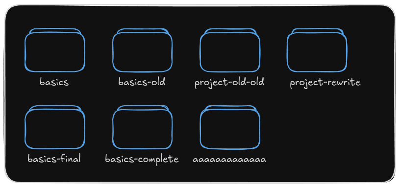

notes: Представьте, что вы пишете что-то, например программу или что-то на человеческом языке, и к вам приходит желание переписать часть текста. Вы удаляете абзац, переписываете его, и через несколько дней понимаете, что изначальная версия вам нравится больше. Однако вы уже давно закрыли редактор, так что CTRL+Z уже не поможет. К счастью, вы сделали копию файла перед тем, как вносить изменения. Вы копируете его обратно и делаете еще одну копию, чтобы сохранить вторую версию. Теперь у вас три файла. Растяните это на месяц работы и получите дерево, которое выглядит примерно так

---

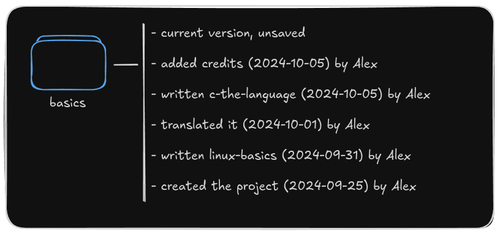

notes: Git превращает этот беспорядок в одну компактную папку со всей историей ее изменений, к каждому из которых прикреплены комментарий, дата и его автор.

---

## Использование git

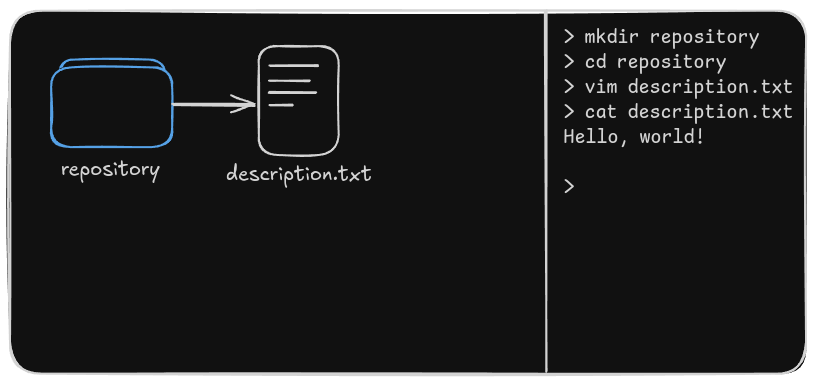

notes: Такие директории, которые находятся под управлением git, называются *репозиториями.*

---

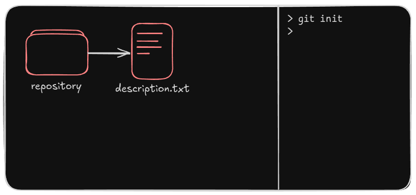

notes: Создадим такую директорию. Git использует интерфейс командной строки, я буду располагать визуальное представление с левой стороны, а терминал - с правой. Команда для создания репозитория называется `init`.

---

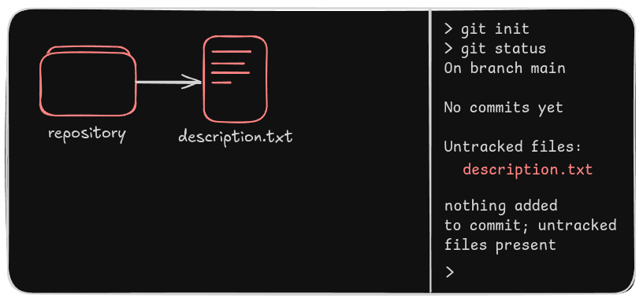

notes: Мы всегда можем узнать в каком состоянии находится репозиторий с помощью команды `status`. Сейчас он пишет нам, что у него пока нет сохраненных версий и что существует один файл, изменения в котором он не отслеживает. Это значит, что если мы допустим, удалим или изменим файл, git не сможет ничего с этим сделать.

---

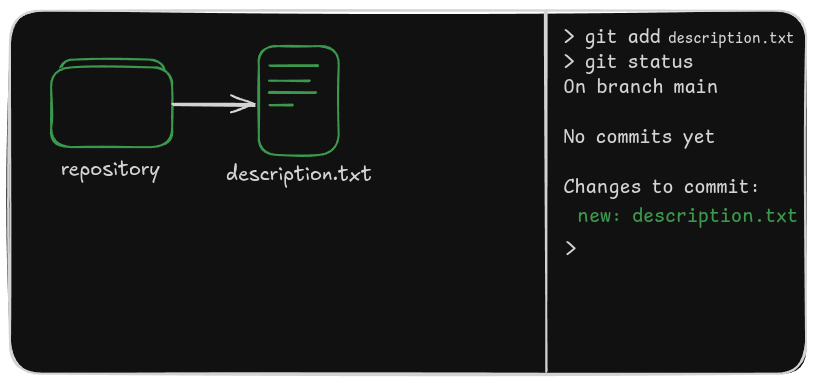

notes: Добавим файл в управление версиями, попросив git отслеживать его состояние. Теперь он сообщает, что этот файл будет добавлен в коммит.  Коммит - это снимок состояния содержимого репозитория плюс метаданные, о которых я говорил ранее.

---

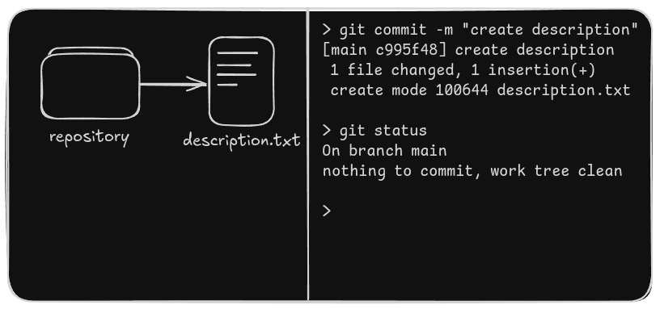

notes: Если мы создадим коммит, статус изменится на " рабочее дерево чистое", что означает, что всё находится под контролем и вы не потеряете данные. Например,

---

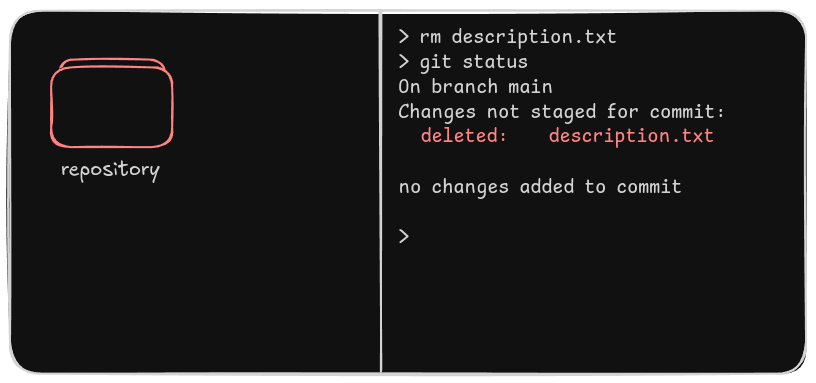

notes: Представим, что мы случайно удалили файл. Статус теперь показывает следующее:

---

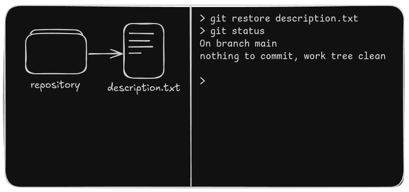

notes: Мы можем попросить git восстановить файл, и он это сделает.

---

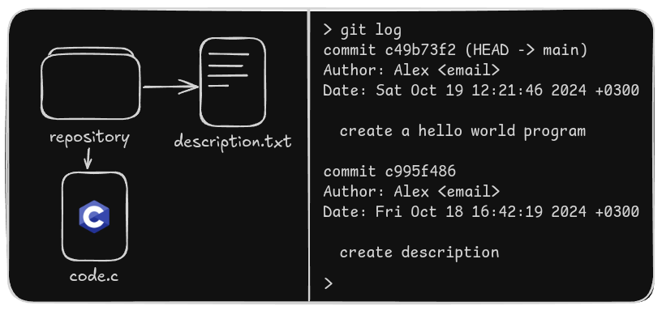

notes: По сути, это 80% того, что вы будете с ним делать: добавлять, коммитить и восстанавливать файлы. Теперь представьте, что мы работаем с этим проектом довольно долго, и у нас есть несколько файлов и несколько коммитов. Мы можем просмотреть их список с помощью команды log,

---

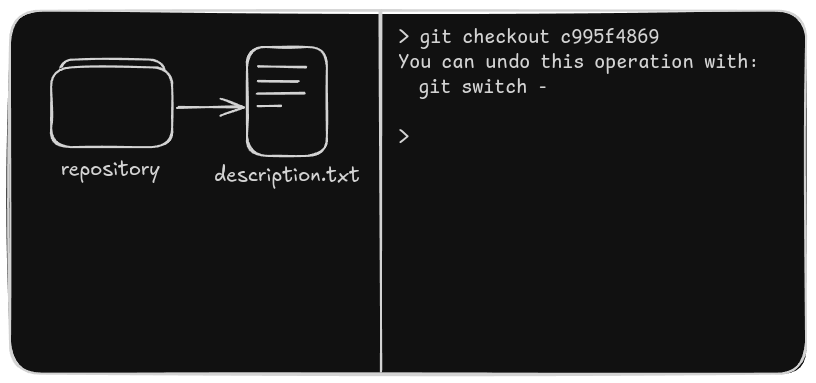

notes: или вернуться к любому из них. При этом ничего не удаляется, вы всегда можете вернуться к последнему состоянию, при условии, что оно было закоммичено.

## Заключение
notes: О ветках мы поговорим в следующий раз, а не буду углубляться в эту тему здесь.

Автор: [alexanderthestudent](https://github.com/alexanderthesensei), 2024-09-30.

Соавтор: [DeepL Translate](https://deepl.com).